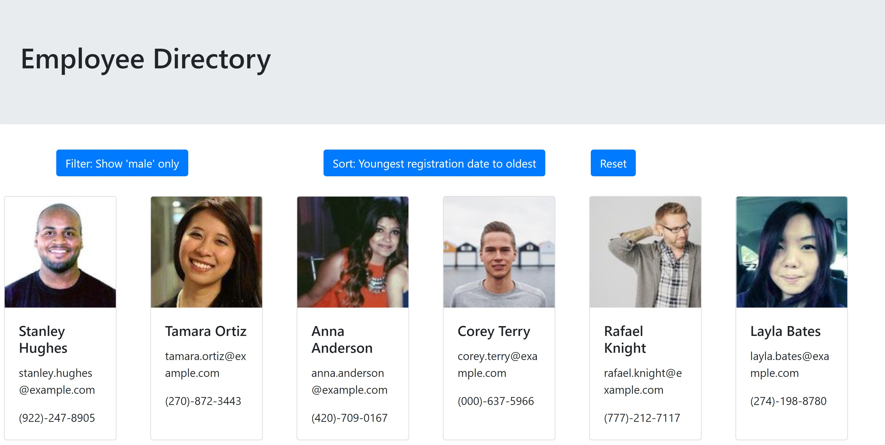

# Employee-Directory-React
This bare-bones react-app shows what could be a functional employee directory. Using the Generate Random User API, it creates a directory of 20 random people who are each assigned a card with their image, name, email address, and phone number easily visible. Included are a "filter by gender: male", "sort by youngest registration to oldest", and "reset" buttons; these are just a few examples of how this directory can be manipulated to easily find the employees you are looking for. 

## Description
Using a boiler-plate create-react-app, react-bootstrap, and axios, this app generates a new employee directory with each refresh. Additional filters, sorts, and other data manipulation can easily be implemented to get a data-set that works for different industries. 

## Screenshot
